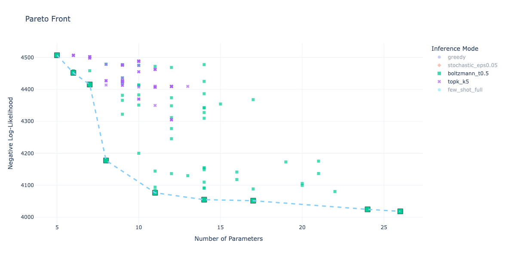

---
hide:
  - navigation
---

# Reinforcement Learning for Automated Discrete Choice Model Specification

**Delphos** is a multitask reinforcement learning agent designed to assist the discrete choice model specification process. The framework formulates model specification as a sequential decision-making problem in which Delphos progressively proposes utility specifications and receives feedback from an estimation environment through metrics such as Log-Likelihood, AIC, BIC, and convergence diagnostics.

Delphos is designed to support both methodological research in reinforcement learning for choice modelling and the practical application of trained agents for assisted model specification.

---

## 📈 Navigating the Specification Pareto Front



*(Above: An example of the Pareto front of specifications generated by Delphos, balancing Goodness-of-Fit and Complexity. You can also explore the [Interactive Version](assets/pareto_front.html))*

---

## [delphos-core](reinforcement_learning/overview.md)

Main research and development repository containing the complete reinforcement learning framework required to train, evaluate, and extend Delphos.

Includes:

- Markov Decision Process formulation
- State and action spaces
- Reward functions
- Task manager
- Reinforcement learning agents
- Environment and Apollo integration
- Training pipelines
- Inference modules
- Benchmarking utilities
- Experiment configurations

## [delphos (User Library)](inference/overview.md)

Lightweight Python package for applying trained Delphos agents in inference mode to unseen or similar discrete choice modelling contexts without requiring further training.

Includes:

- Loading pre-trained weights
- Loading dataset schemas
- Utility specification generation
- Pareto-front generation
- Inference workflows
- Reproducible tutorials
- Deployment examples

## [delphos-datasets](datasets/overview.md)

Repository of standardized transport choice datasets used for training, inference, benchmarking, and reproducibility.

Includes:

- Raw and processed datasets
- Metadata and schemas
- Variable dictionaries
- Benchmark tasks
- Dataset preprocessing pipelines
- Reproducibility resources

---

## Main Features

### Reinforcement Learning for Model Specification

Delphos formulates utility specification as a sequential decision-making problem in which an agent progressively builds and evaluates utility specifications. Moreover, Delphos can propose utility specifications based on modelling strategies learned from previous datasets and experiments.

### Multi-Task Learning

Delphos supports training across multiple transport choice datasets to learn transferable modelling strategies rather than dataset-specific heuristics.

### Reward Functions

Reward functions may incorporate:

- goodness-of-fit,
- model complexity,
- convergence quality,
- parameter significance,
- and behavioural plausibility constraints.

### Apollo Integration

The framework integrates with the Apollo R package for estimation and evaluation of generated specifications.

### Reproducibility and Benchmarking

The ecosystem includes standardized datasets, benchmark tasks, and reproducible workflows for evaluating reinforcement learning approaches for discrete choice model specification.

---

## Repository Structure

```text
Multitask-Delphos/
│
├── docs/
├── tutorials/
├── examples/
├── papers/
│
├── submodules/
│   ├── delphos-core/
│   ├── delphos-user/
│   └── transport-choice-datasets/
│
├── mkdocs.yml
├── README.md
└── CONTRIBUTING.md
```

---

## Citation

If you use Delphos, please cite the corresponding repositories and associated publications.

### Publications

```bibtex
@techreport{nova2025delphos,
  title={Delphos: A reinforcement learning framework for assisting discrete choice model specification},
  author={Nova, Gabriel and Hess, Stephane and van Cranenburgh, Sander},
  year={2025},
  institution={TU Delft},
  url={https://arxiv.org/abs/2506.06410}
}

@techreport{nova2026sharing,
  title={Sharing modelling decisions across assisted choice model specification tasks},
  author={Nova, Gabriel and Hess, Stephane and van Cranenburgh, Sander},
  year={2026},
  institution={TU Delft},
  note={Working paper}
}
```
